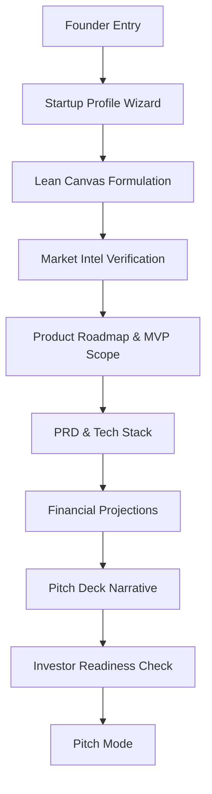

# StartupAI Advanced Feature Blueprint

## 1. Core Mental Model
All features adhere to the **3-Panel Operating System**:
- **Left (Context):** Navigation, Startup Identity, Session state.
- **Main (Work):** Human-first creative and strategic work area.
- **Right (Intelligence):** AI proposals, risk detection, and performance insights.

## 2. Advanced Dashboards

### A. Market Intelligence (`/market-intel`)
**Purpose:** Real-time strategic verification of market demand and competitive shifts.
- **UI Patterns:** Illustrated TAM/SAM/SOM charts, real-time trend feeds, competitor comparison matrix.
- **AI Logic:** Use **Gemini 3 Pro** with `googleSearch` to find recent funding rounds and competitor pivots.

### B. Investor Readiness (`/investor-readiness`)
**Purpose:** Prepare for high-stakes fundraising.
- **UI Patterns:** Global Readiness Score (animated ring), Gap Analysis checklist, VC Q&A Simulator.
- **AI Logic:** **Gemini 3 Pro** with `thinkingConfig` to simulate critical VC logic and identify "unfundable" traits.

### C. Go-To-Market Strategy (`/gtm`)
**Purpose:** Map the launch from zero to first 100 customers.
- **UI Patterns:** ICP (Ideal Customer Profile) cards, Channel comparison heatmaps, Messaging framework.
- **AI Logic:** **Gemini 3 Flash** for fast messaging drafts; **Pro** for channel attribution logic.

## 3. User Journey Diagrams

## 4. AI Strategic Board (Agents)
| Agent | Role | Model | Primary Tool |
| :--- | :--- | :--- | :--- |
| **Julian** | Brand & Story | Gemini 3 Flash | Text Generation |
| **Planner** | Architecture | Gemini 3 Pro | Thinking Config |
| **Analyst** | Market/Finance | Gemini 3 Pro | Google Search |
| **Vera** | GTM Strategist | Gemini 3 Flash | Structured Outputs |

## 5. Model Strategy
- **Gemini 3 Pro (Thinking):** Used for complex reasoning (Financial stress tests, PRD technical constraints).
- **Gemini 3 Flash:** Used for real-time UI interactions, chat, and rapid drafting.
- **Nano Banana Pro:** Used for generating high-quality slide visuals and prototype diagrams.

## 6. Production-Ready Checklist
- [ ] Responsive pass for all new dashboards (Tablet/Mobile).
- [ ] Error boundary implementation for AI failures.
- [ ] Offline caching for document drafts.
- [ ] Accessibility audit (ARIA labels for score rings).
- [ ] Performance optimization for large roadmap renders.

**Success Criteria:** Founders reach a "Fundable" state (Score > 85) within 48 hours of intake.
